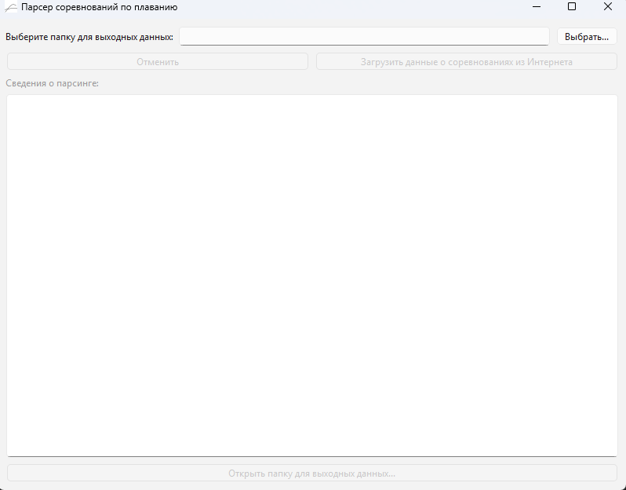

Данная программа предназначена для парсинга данных о результатах соревнований с API World Aquatics  
# Запуск  
Для запуска программы, необходимо сначала скачать данную папку parsing на компютер (например, склонировав весь репозиторий через git clone [https://github.com/ShlumBerg/swimming_prediction_web/](https://github.com/ShlumBerg/swimming_prediction_web/))  
Далее, необходимо открыть терминал в данной папке (parsing).  
Далее, необходимо создать виртуальное окружение python. Рекомендуемая версия python - 3.13:  
```
py -m venv .venv
```
Далее, необходимо активировать виртуальное окружение python:  
Для windows:
```
.\.venv\Scripts\activate
```
Далее, необходимо установить все зависимости для созданного виртуального окружения python:  
```
pip install -r requirements.txt
```
Далее, нужно запустить файл main.py:  
```
python main.py
```
В результате, должно появиться окно с графическим интерфейсом:  
  
# Работа в программе  
Программа позволяет получать результаты прошедших соревнований с API World Aquatics. Для работы программы, необходимо сначала выбрать папку для выходных данных нажатием кнопки "Выбрать...".  
Затем, необходимо начать загрузку данных нажатием на кнопку "Загрузить данные о соревнованиях из Интернета".  
В результате, создастся 2 файла:  
- raw_dataset.txt - файл в формате csv с необроботанным датасетом. Каждая строка в нем соответствует результату одного пловца в одном заплыве.  
- swimmers_db.sqlite - файл в формате БД sqlite с данными о пловцах.  
